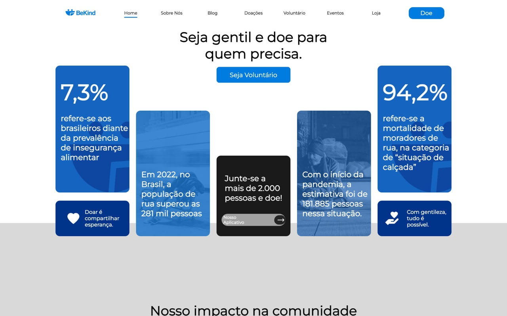
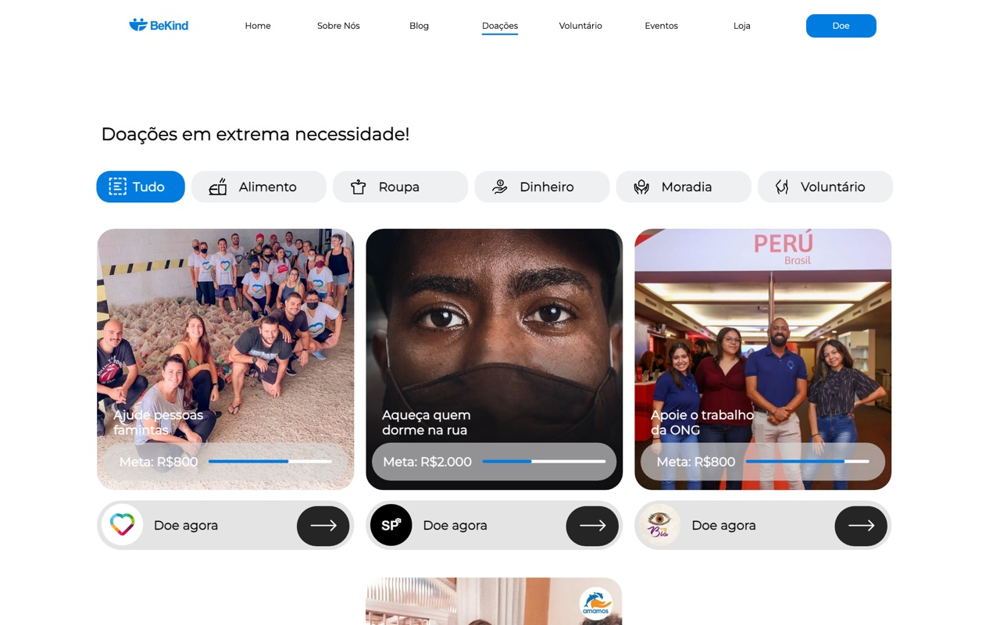
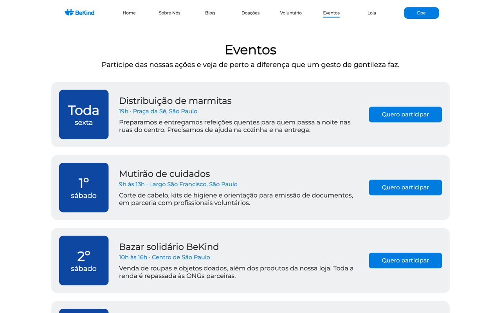
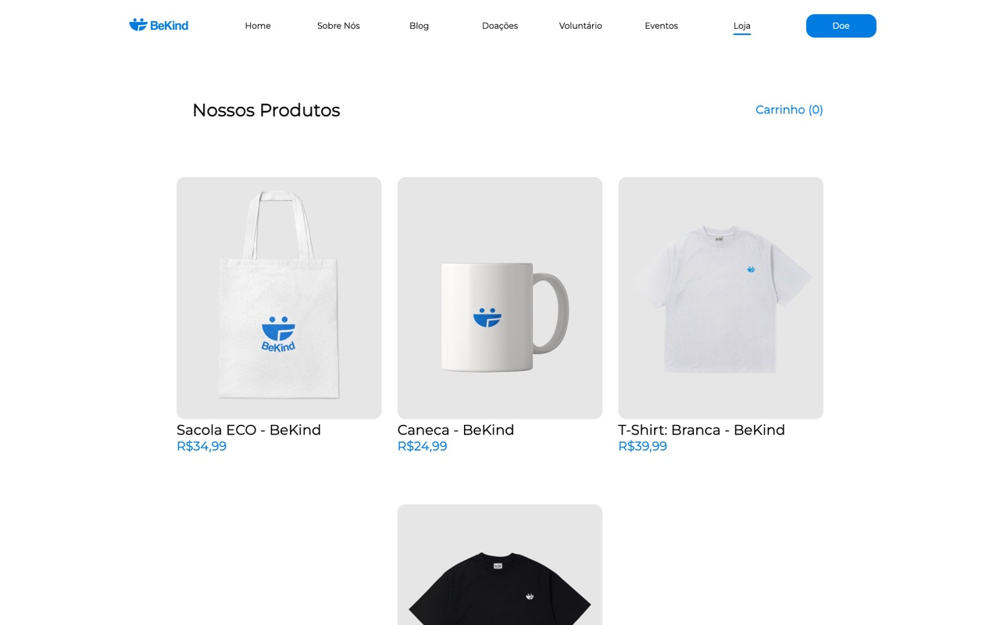

# 💛 BeKind

> Transformando invisibilidade em esperança.

Site do **BeKind**, um projeto social de doações e voluntariado voltado à população em situação de rua, desenvolvido em grupo como **Trabalho de Conclusão de Curso (TCC)** na Etec.

O site apresenta o projeto e conecta quem quer ajudar a quem mais precisa, com páginas para doações, eventos, blog, cadastro de voluntários e uma loja.



| Doações | Eventos | Loja |
| --- | --- | --- |
|  |  |  |

## 📄 Páginas

| Página | Descrição |
| --- | --- |
| Home | Apresentação do projeto, números de impacto e inscrição para novidades |
| Sobre nós | Missão do BeKind e equipe |
| Blog | Publicações das ONGs parceiras |
| Doações | Campanhas das ONGs, com filtro por categoria |
| Eventos | Agenda de ações e eventos |
| Voluntário | Cadastro e login de voluntários |
| Loja | Produtos do projeto, com página de produto e carrinho |

## 🛠️ Tecnologias

`HTML` `CSS` `JavaScript` — sem frameworks nem dependências.

## 📁 Estrutura

```
├── index.html   # redireciona para site/home.html
├── css/         # estilos de cada página (comum.css é compartilhado)
├── img/         # imagens e ícones
├── js/          # script.js, usado por todas as páginas
└── site/        # páginas HTML (home, sobre nós, blog, doações, eventos, voluntário, loja)
```

## ▶️ Como rodar

Abra o arquivo `index.html` no navegador. Não é preciso instalar nada nem subir um servidor.

## ℹ️ Sobre o projeto

O BeKind é um projeto acadêmico e o site é apenas o front-end: não existe servidor por trás dele.

- Os formulários (novidades, cadastro e login) são validados no navegador, mas não enviam nem guardam os dados.
- As doações e as compras da loja não são processadas; o carrinho fica salvo apenas no navegador.
- Os números de impacto, eventos, depoimentos e campanhas são ilustrativos.
- O layout foi desenhado para desktop (1920px). Em telas menores a página é reduzida proporcionalmente.

## 👥 Equipe

Angel Garcia · Gabriel Bedê · Isaque Souza · Israel Esdras · João Doná · Kaic Paulino
